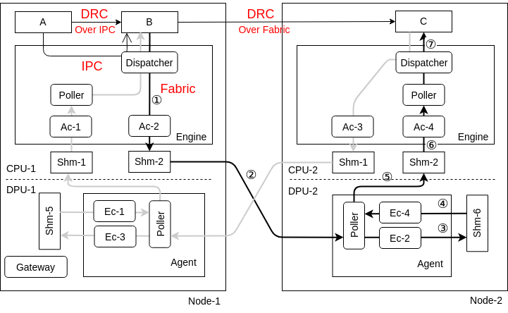

扶摇
---
**扶摇/Fuyao** 是一个开源的服务器无感知计算框架，结合新型硬件DPU（Data Processing Unit），提供了一套适用于节点内外的亚毫秒级中间数据传输方案。

在**扶摇**中实现了四种中间数据的传输方式:

|     数据传输方式      | 适用范围 |    延迟    | 对数据大小的限制 |          说明          |
|:---------------:|:----:|:--------:|:--------:|:--------------------:|
|       IPC       | 节点内  |   亚毫秒级   |    无     |       利用数据局部性        |  
|  DRC_OVER_IPC   | 节点内  | 亚毫秒级（极速） |    无     |  基于函数间动态创建的RDMA直连通道  |  
|     Fabric      | 节点间  |   毫秒级    |    有     | 利用DPU实现节点间无CPU开销数据传递 |  
| DRC_OVER_Fabric | 节点间  | 亚毫秒级（极速） |    无     |  基于函数间动态创建的RDMA直连通道  |  

<font color="#ff3431">**注意**</font>：当前开源的版本，暂时不支持DRC_OVER_IPC, DRC_OVER_Fabric。该特性将在后续版本中，连同对Python编程语言的支持一起推出。

## 架构



## 项目结构

<pre><code>
Fuyao
|---deps
|---lib
    |---base
    |---common
    |---ipc
    |---rdma
    |---runtime
    |---server
    |---utils
|---src
    |---dpu
        |---agent
        |---gateway
    |---host
        |---engine
        |---launcher
        |---worker
            |---cpp
            |---python
</code></pre>

## 编译

『注意』

### 方案一（推荐）:

使用Jetbrains Clion进行编译。

### 方案二:

命令行： cmake

```shell
/usr/bin/cmake -DCMAKE_BUILD_TYPE=Debug -G "CodeBlocks - Unix Makefiles" -S /home/lgw/Fuyao -B /tmp/Fuyao

# 与框架相关
/usr/bin/cmake --build /tmp/Fuyao --target gateway engine agent launcher worker_cpp worker_python -- -j 3

# 与实验一相关
/usr/bin/cmake --builf /tmp/Fuyao --target exp01_fn_a exp01_fn_b exp01_fn_c exp01_fn_d exp01_fn_e exp01_fn_f -- -j 3
```

## 示例

[参考](examples/01/README.md)


